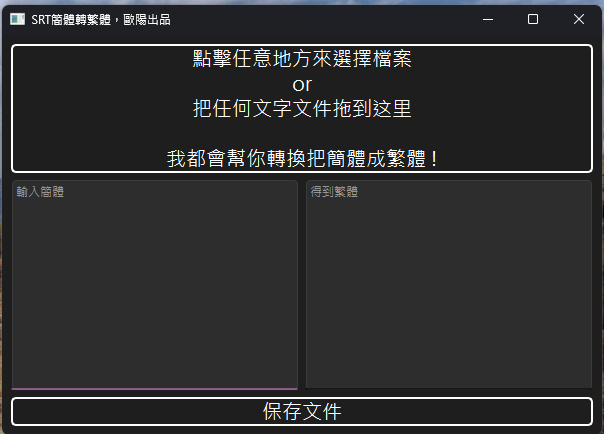

# Download exe

[下載點我](https://github.com/OuYangMinOa/srt_cn_2_tw/releases/tag/v0.0.1)

### - 打開


### - 將文件拖移進去即可


### - 或者點擊畫面選取檔案


### - 可以做一些修正


# 自己下載環境執行

```
git clone https://github.com/OuYangMinOa/srt_cn_2_tw
```

這個專案是使用 [uv](https://github.com/astral-sh/uv) 在維護 

### 安裝套件

```
uv init
uv venv
uv sync
```

### 執行`main.py`
```
uv run python main.py
```

### 或者使用 `pyinstaller` 包裝成exe
```
pyinstaller .\ouyang_srt_converter.spec
```
